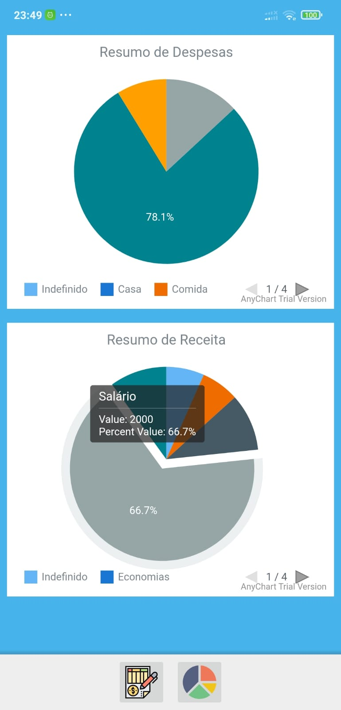

# FinancasPessoais
Aplicativo para controle de finanças Pessoais
# ScreenShots
    
# Recursos
 - Floating Actions Button by clans ('com.github.clans:fab:1.6.4')
 - Graficos by AnyChart('com.github.AnyChart:AnyChart-Android:1.1.2')
 - multidex enable ('com.android.support:multidex:1.0.3')
 - Room database para persistencia interna
 
 Projeto desenvolvido em Kotlin/java utilizando a arquitetura MVVM.
